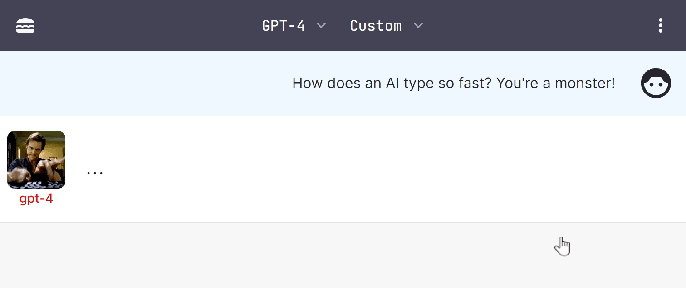

# BIG-AGI 🤖💬

به big-AGI خوش آمدید
! 🎉 برنامه شخصی AGI که ​​توسط OpenAI GPT-4 و فراتر از آن طراحی شده است. این برنامه وب واکنش‌گرا که برای انسان‌های باهوش و ابرقهرمانان طراحی شده است، همراه با پخش جریانی، اجرای کد، واردات PDF، پشتیبانی صوتی، رندر داده، توابع AGI و چت است. به دوستان خود مقداری #انرژی_بزرگ نشان دهید 🚀


[](https://big-agi.com)

Or click fork & run on Vercel

[](https://vercel.com/new/clone?repository-url=https%3A%2F%2Fgithub.com%2Fenricoros%2Fbig-agi&env=OPENAI_API_KEY,OPENAI_API_HOST&envDescription=OpenAI%20KEY%20for%20your%20deployment.%20Set%20HOST%20only%20if%20non-default.)

مفید 👊 
پرسونای هوش مصنوعی جذاب 
Clean UX، w/tokens counters 
حریم خصوصی: کلیدهای API متعلق به کاربر و محلی ذخیره سازی Human I/O: 
پشتیبانی صوتی پیشرفته (TTS، STT) I/O ماشین: واردات و خلاصه سازی PDF، 
اجرای کد بسیاری از به روز رسانی ها و ادغام های دیگر: ElevenLabs، Helicone، Paste.gg در حال ظهور: استدلال خودکار-AGI

### امکانات

#### 🚨 آوریل: moar #mifai-kiyosk

- 🎉 **[Voice Synthesis](docs/pixels/feature_voice_1.png)** 📣 با ElevenLabs، از جمله انتخاب صداهای سفارشی
- 🎉 **تولید تصویر** با استفاده از کلیدهای API Prodia (BYOK)، فقط آن را /imagine (یا /img یا /i) کنید
- 🎉 **[Precise Token Counter](docs/pixels/feature_token_counter.png)** 📈 extra-useful برای بسته بندی پنجره زمینه
- 🎉 **[Install Mobile APP](docs/pixels/feature_pwa.png)** 📲 شبیه بومی است (@madmaxmehdi44)
- 🎉 **[UI language](docs/pixels/feature_language.png)** با auto-detect, و زبان برنامه آینده! (@mehdiminaee)
- 🎉 **PDF Summarization** 🧩🤯 - سوال بپرسید به  PDF! (@mehdiminaee)
- 🎉 **Code Execution: [Codepen](https://codepen.io/)/[Replit](https://replit.com/)** 💻 (@mehdiminaee)
- 🎉 **[SVG Drawing](docs/pixels/feature_svg_drawing.png)** - قرعه کشی با AI 🎨
- 🎉 چت: چت های متعدد، عناوین هوش مصنوعی، واردات/صادرات، حالت انتخاب
- 🎉 رندر: Markdown، SVG، بلوک های کد بهبود یافته
- 🎉 ادغام: شناسه سازمان OpenAI
- 🎉 [Cloudflare deployment instructions](docs/deploy-cloudflare.md),
  [awesome-agi](https://github.com/enricoros/awesome-agi)
- 🎉 [Typing Avatars](docs/pixels/gif_typing_040123.gif) ⌨️
  <!-- p><a href="docs/pixels/gif_typing_040123.gif"></a></p -->

#### مارس: اولین انتشار

- 🎉 **[AI Personas](docs/pixels/feature_purpose_two.png)** - از جمله کد، علم، شرکت و چت 🎭
- 🎉 **حریم خصوصی**: user-owned API keys 🔑 و محل ذخیره سازی 🛡️
- 🎉 **مفاد** - ضمیمه یا [Drag & Drop files](docs/pixels/feature_drop_target.png) برای اضافه کردن آنها به درخواست 📁
- 🎉 **برجسته سازی نحو** - برای چندین زبان 🌈
- 🎉 **Code Execution: Sandpack
  ** - [اکنون در شعبه]((https://mifai-kiyosk.vercel.app/)) `variant-code-execution`
- 🎉 با GPT-4 و 3.5 Turbo گپ بزنید 🧠💨
- 🎉 پخش زمان واقعی پاسخ های هوش مصنوعی ⚡
- 🎉 **ورودی صدا** 🎙️ - روی کروم / ویندوز عالی کار می کند
- 🎉 ادغام: **[Paste.gg](docs/pixels/feature_paste_gg.png)** یکپارچه سازی برای اشتراک گذاری چت 📥
- 🎉 ادغام: **[Helicone](https://www.helicone.ai/)** ادغام برای قابلیت بازرسی API 📊
- 🌙 مدل تاریک - حالت عریض ⛶

## پشتیبانی  🙌

[//]: # ([![Official Discord]&#40;https://img.shields.io/discord/1098796266906980422?label=discord&logo=discord&logoColor=%23fff&style=for-the-badge&#41;]&#40;https://discord.gg/MkH4qj2Jp9&#41;)
[](https://discord.gg/MkH4qj2Jp9)

* Enjoy the hosted open-source app on [big-AGI.com](https://get.big-agi.com)
* [Chat with us](https://discord.gg/MkH4qj2Jp9). We just started!
* Deploy your [fork](https://github.com/enricoros/big-agi/fork) and surprise your friends with big-GPT
  energy!
* We love code - send PRs! ...
  🎭[Editing Personas](https://github.com/enricoros/big-agi/issues/35),
  🧩[Reasoning Systems](https://github.com/enricoros/big-agi/issues/36),
  🌐[Community Templates](https://github.com/enricoros/big-agi/issues/35),
  and [your big-IDEA](https://github.com/enricoros/big-agi/issues/new?labels=RFC&body=Describe+the+idea)s❗

## Why this? 💡

Because the official Chat ___lacks important features___, is ___more limited than the api___, at times
___slow or unavailable___, and you cannot deploy it yourself, remix it, add features, or share it with
your friends.
Our users report that ___big-AGI is faster___, ___more reliable___, and ___features rich___
with features that matter to them.

***Outdated*** screenshot below:


## Code 🧩


Clone this repo, install the dependencies, and run the development server:

```bash
git clone https://github.com/enricoros/big-agi.git
cd big-agi
npm install
npm run dev
```

Now the app should be running on `http://localhost:3000`

### Integrations:

* [ElevenLabs](https://elevenlabs.io/) Voice Synthesis (bring your own voice too) - Settings > Text To Speech
* [Helicone](https://www.helicone.ai/) LLM Observability Platform - Settings > Advanced > API Host: 'oai.hconeai.com'
* [Paste.gg](https://paste.gg/) Paste Sharing - Chat Menu > Share via paste.gg
* [Prodia](https://prodia.com/) Image Generation - Settings > Image Generation > Api Key & Model

---

This project is licensed under the MIT License.

[](https://github.com/enricoros/big-agi/stargazers)
[](https://github.com/enricoros/big-agi/network)
[](https://github.com/enricoros/big-agi/pulls)
[](https://github.com/enricoros/big-agi/LICENSE)

[//]: # ([![GitHub issues]&#40;https://img.shields.io/github/issues/enricoros/big-agi&#41;]&#40;https://github.com/enricoros/big-agi/issues&#41;)

Made with 💙
