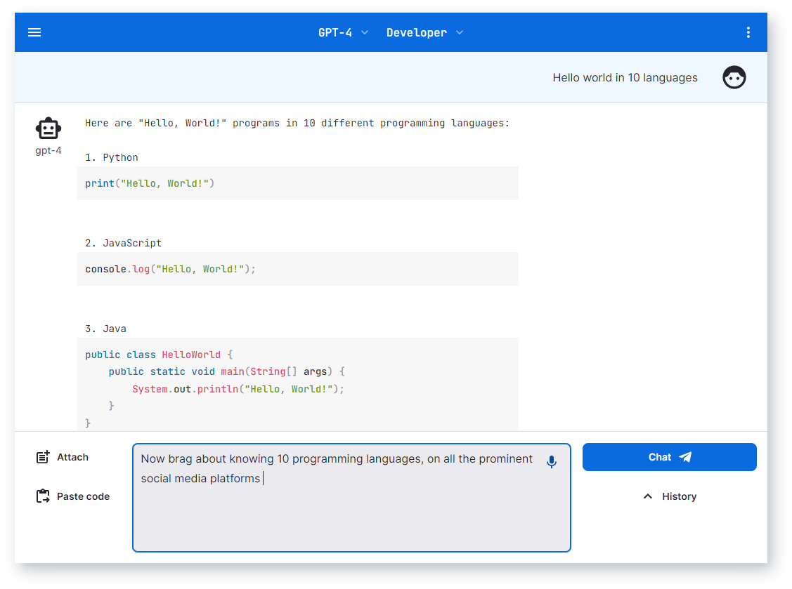

# MiFAI-KiyOsk 🤖💬

به MiFAI-KiyOsk خوش آمدید
! 🎉 برنامه شخصی AGI که ​​توسط OpenAI GPT-4 و فراتر از آن طراحی شده است. این برنامه وب واکنش‌گرا که برای انسان‌های باهوش و ابرقهرمانان طراحی شده است، همراه با پخش جریانی، اجرای کد، واردات PDF، پشتیبانی صوتی، رندر داده، توابع AGI و چت است. به دوستان خود مقداری #انرژی_بزرگ نشان دهید 🚀


[](https://MiFAI-KiyOsk.com)

Or click fork & run on Vercel

[](https://vercel.com/new/clone?repository-url=https%3A%2F%2Fgithub.com%2Fenricoros%2Fbig-agi&env=OPENAI_API_KEY,OPENAI_API_HOST&envDescription=OpenAI%20KEY%20for%20your%20deployment.%20Set%20HOST%20only%20if%20non-default.)

مفید 👊 
پرسونای هوش مصنوعی جذاب 
Clean UX، w/tokens counters 
حریم خصوصی: کلیدهای API متعلق به کاربر و محلی ذخیره سازی Human I/O: 
پشتیبانی صوتی پیشرفته (TTS، STT) I/O ماشین: واردات و خلاصه سازی PDF، 
اجرای کد بسیاری از به روز رسانی ها و ادغام های دیگر: ElevenLabs، Helicone، Paste.gg در حال ظهور: استدلال خودکار-AGI

### امکانات

#### 🚨 آوریل: moar #mifai-kiyosk

- 🎉 **[سنتز صدا](docs/pixels/feature_voice_1.png)** 📣 با ElevenLabs، از جمله انتخاب صداهای سفارشی
- 🎉 **تولید تصویر** با استفاده از کلیدهای API Prodia (BYOK)، فقط آن را /imagine (یا /img یا /i) کنید
- 🎉 **[شمارنده توکن دقیق](docs/pixels/feature_token_counter.png)** 📈 extra-useful برای بسته بندی پنجره زمینه
- 🎉 **[برنامه موبایل را نصب کنید](docs/pixels/feature_pwa.png)** 📲 شبیه بومی است (@madmaxmehdi44)
- 🎉 **[زبان رابط کاربری](docs/pixels/feature_language.png)** با auto-detect, و زبان برنامه آینده! (@mehdiminaee)
- 🎉 **خلاصه سازی PDF** 🧩🤯 - سوال بپرسید به  PDF! (@mehdiminaee)
- 🎉 **اجرای کد: [Codepen](https://codepen.io/)/[Replit](https://replit.com/)** 💻 (@mehdiminaee)
- 🎉 **[طراحی SVG](docs/pixels/feature_svg_drawing.png)** - قرعه کشی با AI 🎨
- 🎉 چت: چت های متعدد، عناوین هوش مصنوعی، واردات/صادرات، حالت انتخاب
- 🎉 رندر: Markdown، SVG، بلوک های کد بهبود یافته
- 🎉 ادغام: شناسه سازمان OpenAI
- 🎉 [دستورالعمل های استقرار Cloudflare](docs/deploy-cloudflare.md),
  [awesome-agi](https://github.com/enricoros/awesome-agi)
- 🎉 [Typing Avatars](docs/pixels/gif_typing_040123.gif) ⌨️
  <!-- p><a href="docs/pixels/gif_typing_040123.gif"></a></p -->

#### مارس: اولین انتشار

- 🎉 **[AI Personas](docs/pixels/feature_purpose_two.png)** - از جمله کد، علم، شرکت و چت 🎭
- 🎉 **حریم خصوصی**: user-owned API keys 🔑 و محل ذخیره سازی 🛡️
- 🎉 **مفاد** - ضمیمه یا [Drag & Drop files](docs/pixels/feature_drop_target.png) برای اضافه کردن آنها به درخواست 📁
- 🎉 **برجسته سازی نحو** - برای چندین زبان 🌈
- 🎉 **اجرای کد: Sandpack
  ** - [اکنون در شعبه]((https://mifai-kiyosk.vercel.app/)) `variant-code-execution`
- 🎉 با GPT-4 و 3.5 Turbo گپ بزنید 🧠💨
- 🎉 پخش زمان واقعی پاسخ های هوش مصنوعی ⚡
- 🎉 **ورودی صدا** 🎙️ - روی کروم / ویندوز عالی کار می کند
- 🎉 ادغام: **[Paste.gg](docs/pixels/feature_paste_gg.png)** یکپارچه سازی برای اشتراک گذاری چت 📥
- 🎉 ادغام: **[Helicone](https://www.helicone.ai/)** ادغام برای قابلیت بازرسی API 📊
- 🌙 مدل تاریک - حالت عریض ⛶

## پشتیبانی  🙌

[//]: # ([![Official Discord]&#40;https://img.shields.io/discord/1098796266906980422?label=discord&logo=discord&logoColor=%23fff&style=for-the-badge&#41;]&#40;https://discord.gg/MkH4qj2Jp9&#41;)
[](https://discord.gg/MkH4qj2Jp9)

* Enjoy the hosted open-source app on [big-AGI.com](https://get.big-agi.com)
* [Chat with us](https://discord.gg/MkH4qj2Jp9). We just started!
* Deploy your [fork](https://github.com/enricoros/big-agi/fork) and surprise your friends with big-GPT
  energy!
* We love code - send PRs! ...
  🎭[ویرایش پرسوناها](https://github.com/madmaxmehdi44/mifai-kiyosk),
  🧩[سیستم های استدلال](https://github.com/madmaxmehdi44/mifai-kiyosk),
  🌐[الگوهای انجمن](https://github.com/madmaxmehdi44/mifai-kiyosk),
  و [ایده بزرگ شما](https://github.com/madmaxmehdi44/mifai-kiyosk)s❗

## چرا این؟ 💡

از آنجا که چت رسمی ___ فاقد ویژگی های مهم است___، گاهی اوقات ___ محدودتر از api___ است 73 ___آهسته یا در دسترس نیست___، و شما نمی توانید خودتان آن را مستقر کنید، آن را دوباره میکس کنید، ویژگی هایی اضافه کنید، یا آن را با آن به اشتراک بگذارید 74 دوستان تو.

کاربران ما گزارش می دهند که ___MiFAI-KiyOsk سریعتر است___، ___قابل اعتمادتر___، و ___ویژگی های غنی___ 76 با ویژگی هایی که برای آنها مهم است. 77
***منسوخ*** اسکرین شات زیر:


## کد 🧩


Clone this repo, install the dependencies, and run the development server:

```bash
git clone https://github.com/madmaxmehdi44/mifai-kiyosk.git
cd mifai-kiyosk
npm install
npm run dev
```

Now the app should be running on `http://localhost:3000`

### Integrations:

* [ElevenLabs](https://elevenlabs.io/) Voice Synthesis (bring your own voice too) - Settings > Text To Speech
* [Helicone](https://www.helicone.ai/) LLM Observability Platform - Settings > Advanced > API Host: 'oai.hconeai.com'
* [Paste.gg](https://paste.gg/) Paste Sharing - Chat Menu > Share via paste.gg
* [Prodia](https://prodia.com/) Image Generation - Settings > Image Generation > Api Key & Model

---

This project is licensed under the MIT License.

[](https://github.com/madmaxmehdi44/mifai-kiyosk.git)
[](https://github.com/madmaxmehdi44/mifai-kiyosk.git)
[](https://github.com/madmaxmehdi44/mifai-kiyosk.git)
[](https://github.com/madmaxmehdi44/mifai-kiyosk.git)

[//]: # ([![GitHub issues]&#40;https://img.shields.io/github/issues/enricoros/big-agi&#41;]&#40;https://github.com/madmaxmehdi44/mifai-kiyosk.git;)

Made with 💙
